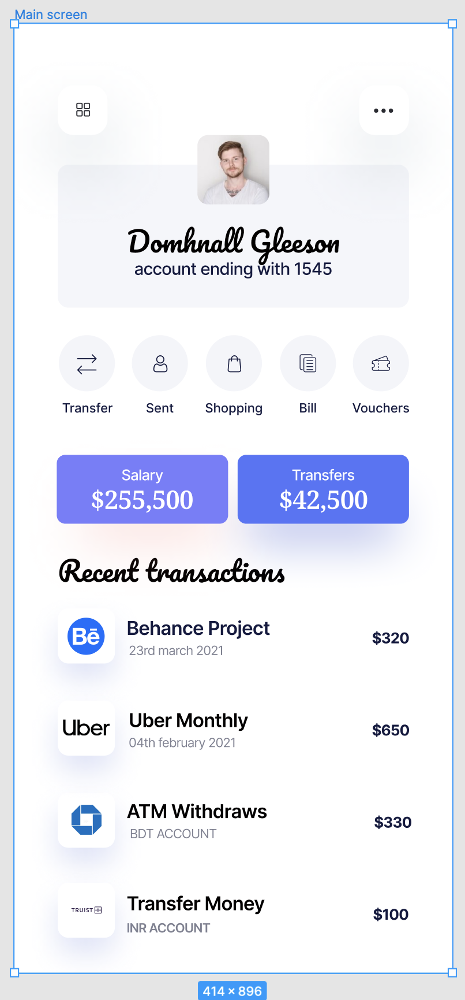

# Design

## Functional Requirements

1. The application should only have one screen and that screen is a landing page.
1. The landing page shows the account summary and dashboard for a mock authenticated and logged in user.
1. The application should be integrated with the transaction management API.
1. The landing page should show the mock user's profile photo, full name, and an anonymized account number showing only the last 4 digits.
1. The landing page should show three buttons that detail the user's monthly salary, current account balance, and the total amount of transactions made on the account, respectively.
1. The landing page should show a listing of recent transactions.

## Non-Functional Requirements

1. The database should be implemented in SQL Server.
1. The frontend application should be designed and implemented as mobile-first, then gracefully degrading to responsive.

## User Stories

1. As an end-user, I want to be able to view my account summary and dashboard so that I get a quick view of my finances.
1. As an end-user, I want to be able to view my profile photo, full name, and an anonymized account number showing only the last 4 digits.
1. As an end-user, I want to be able to view my current balance and the total amount of transactions made on the account.
1. As an end-user, I want to be able to view a listing of recent transactions.
1. As an end-user, I want to be able to have an identical or similar user experience of the application on both mobile device and desktop.

## Proposed Visual Design



## UI Component Hierarchy

```
AccountDashboard
    AccountProfileInfo
    BalanceDashboard
        AccountBalance
        TransfersBalance
    TransactionsList
```
